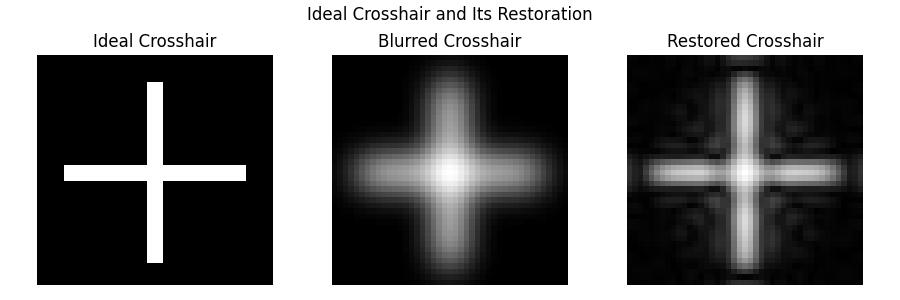
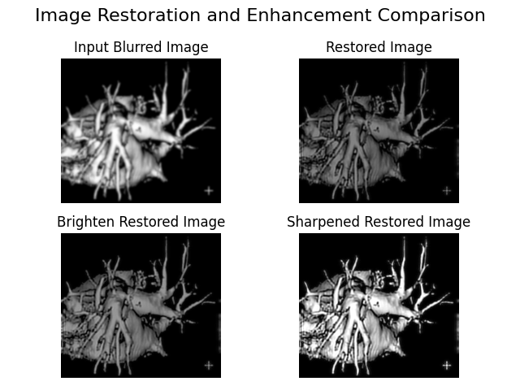

# Image Restoration in Frequency Domain

## Problem Statement

### Problem
Given a blurred image of a heart, the task is to recover the degraded function. It is known that, the bottom right corner crosshair image before degraded, is 3 pixels wide, 30 pixels long, and had an intensity of 255.

Further more, try to restore the original image.

The heart image is given as follow:

<div align="center">
    <a href="https://github.com/thaiquangphat/Image-Restoration-in-Frequency-Domain/blob/main/image/heart.jpg" target="_blank">
        
    </a>
    <p><em>Blurred heart image</em></p>
</div>

### Assumptions

Upon solving this problem, we consider the following assumption:
- <b>No knowledge of the original heart image:</b> We will recover the degraded image as to verify the correctness of the degraded function, with not having the original heart image, thus at the restored result, we accept the result to our understanding.


## Approach

A detailed explanation of our approach is given in the <a href="https://github.com/thaiquangphat/Image-Restoration-in-Frequency-Domain/blob/main/doc/presentation.pdf" target="_blank">
presentation file</a>. This document contains a step-by-step instruction of how to obtain resulted images.

## Experimental Results
Our result shows that the resulting degraded function is estimated to be the Gaussian filter function. 

First of all, we successfully recover the crosshair image to the best.

<div align="center">
  <a href="https://github.com/thaiquangphat/Image-Restoration-in-Frequency-Domain/blob/main/image/restore_crosshair.jpg" target="_blank">
    
  </a>
  <p><em>Restored Crosshair and it Comparisons</em></p>
</div>

As the document presented, here is the result obtained using the Gaussian filter.
<div align="center">
  <a href="https://github.com/thaiquangphat/Image-Restoration-in-Frequency-Domain/blob/main/image/result_comparison.png" target="_blank">
    
  </a>
  <p><em>Gaussian lowpass estimated results</em></p>
</div>

# Use The Project

## File description

- `main.py`: Calling the restoration procedure from `restore.py`.
- `restore.py`: A detail restoration procedure.
- `ultis.py`: Includes the Gaussian filter function.
- `fourier.py`: Visualize the Fourier spectrum images.
- `histogram.py`: Visualize the histogram of segmented images.
- `crop.py`: Cropping out regions in four resulted images for comparison.

## Run & Installation

Feel free to use the code, here are the instructions:

Clone the repository

```bash
git clone https://github.com/thaiquangphat/Image-Restoration-in-Frequency-Domain.git
```

Change directory to the project
```bash
cd Image-Restoration-in-Frequency-Domain
```

To directly test the project, run
```bash
python main.py
```

You can also run the following files to obtain the result mentioned above
```bash
python fourier.py
python crop.py
python histogram.py
```